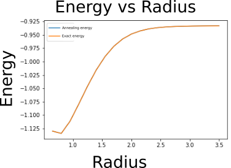

## Project 4: Ising Annealing

Your final week's project will guide you through the process of mapping an electronic structure Hamiltonian to a classical Ising model, and then solving for the groundstate of the model using a thermal anneling Monte Carlo simulation.

A very brief introduction to the main ideas behind the project, and the basics of the Monte Carlo method are
[here.](https://github.com/CDL-Quantum/CohortProject_2020/blob/master/CDL_2020_docs.pdf)

In our [Project4_LandingPage.pdf](https://github.com/CDL-Quantum/CohortProject_2020/blob/master/Project_4_Ising_Annealer/Project4_LandingPage.pdf),
we provide more technical information the Ising Hamiltonians involved.
Click on this link to begin learning about your tasks for this week!

## Tasks include:
* Perform thermal annealing to solve for the groundstate of a ferromagnetic Ising model.

### [Task 1](Task_1.ipynb) 2D Ferromagnetic Ising on a PBC Square Lattice: 
In this task we determined the ground state configuration of the two-dimensional Ising model through simulated annealing
using an exponential annealing schedule.

<figure>
  
  <figcaption> <b>Left:<\b> The initial state of Ising model.  <b>Right:<\b> The ground state configuration of the Ising model. </figcaption>
</figure>

### [Task 2](Task_2.ipynb) Some Simple Spin Glasses:
In this task, two different annealing schedules (the exponential and linear schedule) were implemented and compared
against one another. These two schedules were tested on the Ising model aswell as for the fully 
connected Mattis model. 

<figure>
  
  <figcaption> <b>Left:<\b> The energy vs number of spin objects for an Ising model using a linear annealing schedule and an exponential schedule. 
  <b>Right:<\b> The energy vs number of spin objests for the Mattis model using the linear and exponential annealing schedule. </figcaption>
</figure>

### [Task 3](Task_3.ipynb) Electronic Structure Calculations using Generalized Ising Hamiltonians
In this task, we transformed k-local hamiltonian to 2-local hamiltonian. Once transformed, we embedded 
it on the D-Wave's chimera topology and used quantum annealing on the real device to obtain the optimal value.

<figure>
  
  <figcaption>The ground state energy of the hydrogen atom solved using a simulated annealing procedure as a function of the radius.</figcaption>
</figure>

## Further Challenges: 
* Explore the annealing procedure on the Mattis glass.
* Devise a 2-local Ising Hamiltonian for the Hydrogen molecule, and compare your results.
* Solve your 2-local Hamiltonian (or any Hamiltonian) on open-source commercial software, and compare the performance.
* Go wild and try thermal annealing on your favorite NP-hard problem!

## Business Application
One again, your team is asked to complete a Business Application. Questions you will be asked are:

* Explain to a layperson the technical problem you solved in this exercise.
* Explain or provide examples of the types of real-world problems this solution can solve.
* Identify at least one potential customer for this solution - ie: a business who has this problem and would consider paying to have this problem solved.
* Prepare a 90 second video explaining the value proposition of your innovation to this potential customer in non-technical language.

For more details refer to the [Business Application found here](./Business_Application.md)

## Presenting your results in your pull request
For your pull request, consider the following for the presentation of your final results:
- Work entirely in the directory for Project 4.
- Edit this README.md file with a highlight of your main technical results.  Provide links to any other files with your detailed results, e.g. Jupyter notebooks.
- For your Business Application, feel free to provide your answers directly in the 
[Business_Application.md](./Business_Application.md) file.
- Do not directly upload your video file (or any other large files) to the repository.  Instead, provide a link e.g. to a YouTube video, or a Google Drive file.
- Include a file contributions.md that lists the contributions of each group member.
